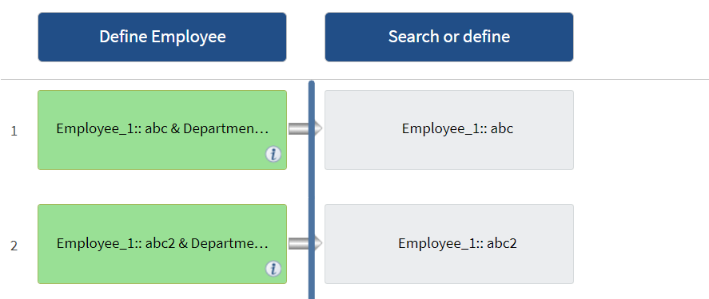

= Cómo funciona la repetición de la fila
:allow-uri-read: 
:icons: font
:imagesdir: ../media/

[role="lead"]
Un flujo de trabajo contiene comandos y detalles de comandos organizados en filas. Puede especificar los comandos de una fila que se van a repetir para un número fijo de iteraciones o un número dinámico de iteraciones basándose en los resultados de los criterios de búsqueda.

Los detalles del comando de una fila se pueden especificar para repetir un número determinado de veces o cuando se diseña el flujo de trabajo. El flujo de trabajo también se puede diseñar de forma que el número de veces que debe repetirse la fila se pueda especificar cuando el flujo de trabajo se ejecute o se programe para una ejecución. Puede especificar criterios de búsqueda para un objeto y los comandos de una fila se pueden establecer para que se repitan tantas veces como los criterios de búsqueda devuelven los objetos. Las filas también se pueden configurar para que se repitan cuando se cumplan ciertas condiciones.

== Variables de repetición de fila

Puede especificar variables en la lista de variables que se pueden manipular durante las iteraciones de fila. Para las variables, puede especificar un nombre, un valor con el que se inicializan las variables y una expresión MVFLEX Expression Language (MVEL) que se evalúa después de cada repetición de la fila.

En la siguiente ilustración se muestran las opciones de repetición de fila y un ejemplo de una variable de repetición de fila:

image::../media/row_repetition_details.png[detalles de repetición de filas]

== Repetición de fila con puntos de aprobación

Si ha especificado iteraciones de filas de repetición para comandos y ha incluido puntos de aprobación, se ejecutan todas las iteraciones de los comandos antes de un punto de aprobación. Después de aprobar el punto de aprobación, la ejecución de todas las iteraciones de los comandos sucesivos continúa hasta el siguiente punto de aprobación.

La siguiente ilustración muestra cómo se ejecutan las iteraciones de filas repetidas cuando se incluye un punto de aprobación en un flujo de trabajo:

== Repetir ejemplos de fila en flujos de trabajo predefinidos

Puede abrir los siguientes flujos de trabajo predefinidos en el Diseñador para comprender cómo se utilizan las filas repetidas:

* Cree un volumen NFS de Clustered Data ONTAP
* Crear un almacén de datos NFS de VMware en el almacenamiento de Data ONTAP en clúster
* Establezca la relación entre clústeres
* Quite un volumen de Data ONTAP en clúster

